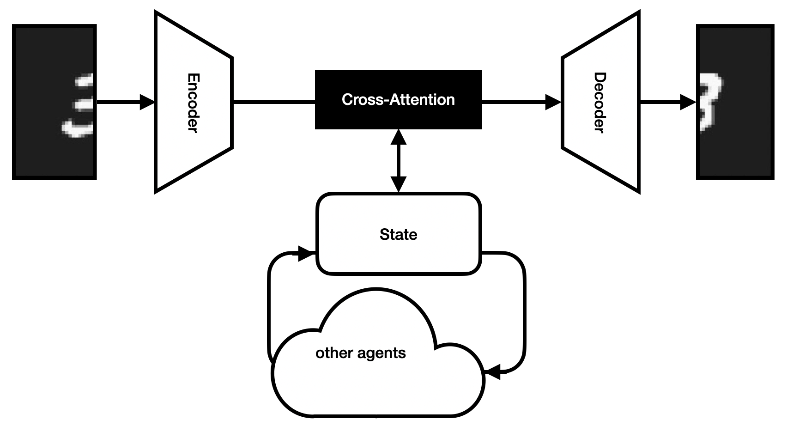
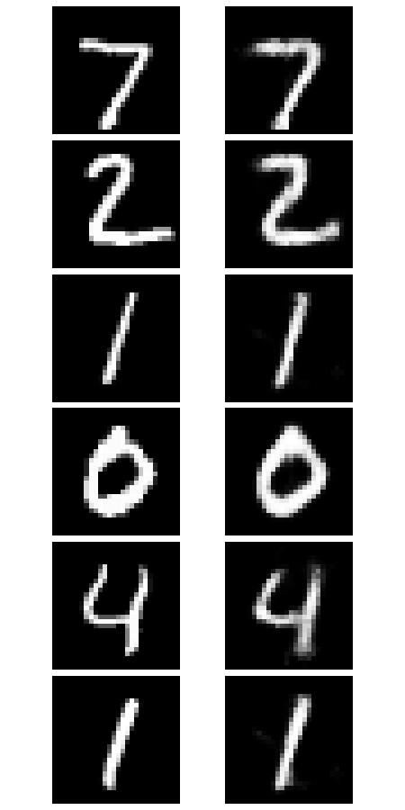

# Mini Collaborative (autoencoder)-Model

<p align="center"> 
     
</p>

MiniCoMo is a collaborative autoencoder designed to test communication systems between agents. Its architecture is inspired by [CUT3R](https://cut3r.github.io), encoding inputs, applying cross-attention with a shared state space, and decoding the modified encodings. Agents write collaborative messages to the state via attention. While a basic linear encoder-decoder with two collaboration layers can outperform this model, performance is not the primary goal of this repo.

<p align="center"> 
     
</p>

**Collaboration Details**

<details>

The collaboration involves two agents, each tasked with predicting the other's input. MNIST images are randomly rotated, flipped, and then split in half-each agent receives one half and must reconstruct the other. Effective communication is essential to complete the image. To ensure robustness, halves are randomly swapped with 50% probability, preventing reliance on fixed positions. (Interestingly, performance drops when the same agent collaborates with itself.)

*NOTE*: Update the [`base_dataset`](src/datasets/utils/base_dataset.py) to support more agents simultaneously.

</details>

## :gear: Setup

### Repository

1. **Clone Repo**

    ```bash
    git clone https://github.com/mkiefferus/miniCoMo
    ```

2. **Setup and activate Conda environment**

    ```bash
    conda env create -f environment.yaml -y

    conda activate coda
    ```

### MNIST

<details>

Please download the MNIST dataset from [Kaggle](https://www.kaggle.com/datasets/hojjatk/mnist-dataset) and place it into your data folder. Make sure to set the dataset path in [`config.yaml`](src/config.yaml) (current default: `"data/mnist"`)

</details>

## :cook: Model Training

Run your training via [`train.py`](src/train.py), which will also visualise the first six images from the frist test batch at the end of each training.

    ```bash
    python src/train.py
    ```

Configure hyperparameters (e.g. `batch_size`, `state_size`, collaboration module, message size) in [`config.yaml`](src/config.yaml)

The model supports loading pretrained weights and saving individual agents.

## Limitations

This model is primarily a testbed for collaboration mechanisms, not performance. It currently supports only two agents (see collaboration details). 

The architecture is intentionally inefficient for the task, requiring many iterations to achieve acceptable results.

**Author: [Max KIEFFER](https://github.com/mkiefferus)**